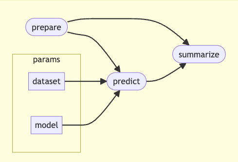

# artemis-kgs-link-predictions

Knowledge Graph Link Prediction Pipeline

[](https://www.nextflow.io/)
[](https://www.docker.com/)
[](LICENSE)

## Table of Contents

- [Overview](#overview)
- [Features](#features)
- [Supported Datasets](#supported-datasets)
- [Pipeline Architecture](#pipeline-architecture)
- [Requirements](#requirements)
- [Installation](#installation)
- [Quick Start](#quick-start)
- [Usage](#usage)
- [Configuration](#configuration)
- [Output Files](#output-files)
- [Pipeline Scripts](#pipeline-scripts)
- [Docker Image](#docker-image)
- [Contributing](#contributing)
- [License](#license)

## Overview

artemis-kgs-link-predictions is a scalable Nextflow pipeline that leverages knowledge graph embeddings to predict gene-term associations across multiple biomedical knowledge graphs. The pipeline uses PyKEEN-trained models to generate predictions for diseases, pathways, biological processes, and other biomedical entities.

Built for precision medicine and drug discovery applications, artemis-kgs-link-predictions automates the entire workflow from data preparation to prediction aggregation, supporting parallel processing of terms across different knowledge graph databases using containerized execution.

## Features

- **Multi-Dataset Support**: Works with Hetionet, BioKG, OpenBioLink, and PrimeKG
- **Scalable Predictions**: Parallel processing of terms for efficient large-scale predictions
- **Knowledge Graph Embeddings**: Utilizes PyKEEN 1.11.0 models for accurate association scoring
- **Flexible Sampling**: Optional downsampling to 10,000 terms for faster testing
- **Cloud-Native**: Built-in S3 support for model loading and data storage
- **Reproducible**: Containerized execution with Docker and deterministic random seeds
- **Test Mode**: Quick validation with 2 terms before full production runs
- **Automatic Retry**: Processes automatically retry with exponential resource scaling (up to 5 retries)

## Supported Datasets

### Hetionet
A network of biology and disease knowledge integrating 47,031 nodes (11 types) and 2,250,197 relationships (24 types). Uses dataset-specific relation types (GpBP, GpPW, GpCC, GpMF, AeG, CbG, DaG, GiG) for predictions. Predicts associations for:
- Biological Processes (Gene participates in Biological Process)
- Pathways (Gene participates in Pathway)
- Cellular Components (Gene participates in Cellular Component)
- Molecular Functions (Gene participates in Molecular Function)
- Anatomies (Anatomy expresses Gene)
- Compounds (Compound binds Gene)
- Diseases (Disease associates with Gene)
- Genes (Gene interacts with Gene)

### BioKG
Comprehensive biomedical knowledge graph focusing on proteins, diseases, drugs, and pathways. Uses metadata files (biokg.metadata.protein.tsv, biokg.metadata.disease.tsv, biokg.metadata.pathway.tsv, biokg.metadata.drug.tsv) and links file (biokg.links.tsv) for extraction. Extracts:
- Human Proteins (filtered by SPECIES='HUMAN')
- Diseases (PROTEIN_DISEASE_ASSOCIATION)
- Pathways (PROTEIN_PATHWAY_ASSOCIATION)
- Drugs (Drug-Protein Interaction, reverse direction)
- Protein Complexes (MEMBER_OF_COMPLEX)
- Genetic Disorders (RELATED_GENETIC_DISORDER)

### OpenBioLink
Large-scale open biomedical knowledge graph containing gene, disease, and phenotype associations. Uses NCBI gene information (Homo_sapiens.gene_info) for protein-coding genes and nodes.csv for graph structure. All predictions use Gene → Term direction with relation types:
- GENE_EXPRESSED_ANATOMY (anatomy)
- GENE_GO (GO terms)
- GENE_DRUG (drugs)
- GENE_PHENOTYPE (phenotypes)
- GENE_PATHWAY (pathways)
- GENE_DIS (diseases)
- GENE_GENE (gene interactions)

### PrimeKG
Precision Medicine Knowledge Graph integrating 20+ biomedical resources with focus on drug discovery. Uses nodes.csv for entity extraction. All predictions use Term → Gene (reverse) direction. Covers gene/protein entities across diverse biomedical contexts:
- anatomy (anatomy_protein_present)
- biological_process (bioprocess_protein)
- cellular_component (cellcomp_protein)
- disease (disease_protein)
- drug (drug_protein)
- exposure (exposure_protein)
- molecular_function (molfunc_protein)
- pathway (pathway_protein)
- effect/phenotype (phenotype_protein)
- gene/protein (protein_protein)

## Pipeline Architecture



The pipeline consists of three main stages:

### 1. Prepare
Extracts and processes knowledge graph data:
- Loads the specified dataset using PyKEEN (Hetionet, BioKG, OpenBioLink, or PrimeKG)
- Concatenates training, testing, and validation triples into a single NumPy array
- Extracts genes and terms based on dataset-specific criteria using metadata files from S3
- Generates hash tables mapping IDs to human-readable names
- Optional downsampling to 10,000 terms using random seed 42 for reproducibility
- Uses dataset-specific processing functions for each knowledge graph

**Outputs:**
- `triples.npy`: All knowledge graph triples (NumPy array)
- `terms.csv`: List of terms for prediction (one per line)
- `genes_hash_table.csv`: Gene ID to name mappings (2 columns: ID, Name)
- `terms_hash_table.csv`: Term ID to name and type mappings (2-3 columns: ID, Name, [Type])

### 2. Predict
Generates predictions for each term in parallel:
- Uses trained PyKEEN models loaded with `torch.load` (weights_only=False)
- Processes each term independently using Nextflow's parallel processing
- Determines appropriate relation types and prediction direction (head→tail or tail→head) based on dataset and term type
- Uses PyKEEN's `predict.predict_target()` function for scoring
- Handles dataset-specific relation mappings (HETIONET_RELATIONS, BIOKG_RELATIONS, etc.)
- Applies random seeds for reproducibility (seed=42)
- Creates safe filenames by replacing special characters with underscores
- Outputs individual prediction files per term in transposed format (term as row, genes as columns)

**Outputs:**
- `<term>_predictions.csv`: Per-term prediction files with scores rounded to 1 decimal place

### 3. Summarize
Aggregates and annotates all predictions:
- Combines predictions from all terms using `collectFile` to create a metafile
- Transposes data from terms×genes to genes×terms format
- Maps IDs to human-readable gene and term names using hash tables
- Sorts columns alphabetically for consistency
- Removes duplicate genes and terms
- Calculates final output statistics (file size, total predictions)

**Outputs:**
- `predictions.csv`: Final aggregated predictions with gene names as rows and term names as columns

## Requirements

- **Nextflow** >= 23.04.0
- **Docker** or **Singularity** (for containerized execution)
- **AWS CLI** (optional, for S3 access)

### Python Dependencies (included in Docker image)
As specified in [requirements.txt](requirements.txt):
- pandas
- numpy
- pykeen==1.11.0
- torch
- s3fs

## Installation

1. **Install Nextflow:**

```bash
curl -s https://get.nextflow.io | bash
sudo mv nextflow /usr/local/bin/
```

2. **Clone the repository:**

```bash
git clone https://github.com/alethiotx/artemis-kgs-link-predictions.git
cd artemis-kgs-link-predictions
```

3. **Verify installation:**

```bash
nextflow -version
```

## Quick Start

### Test Run (Local)
Run with 2 terms to validate setup:

```bash
nextflow run main.nf \
  -profile local \
  --dataset hetionet \
  --model /path/to/trained_model.pkl \
  --env test \
  --sample false
```

Note: Test mode (`--env test`) processes only the first 2 terms regardless of sampling settings.

### Production Run (Hetionet)
Full prediction run with all terms:

```bash
nextflow run main.nf \
  -profile hetionet \
  --dataset hetionet \
  --model s3://bucket/path/trained_model.pkl \
  --env prod \
  --sample false
```

## Usage

### Basic Command Structure

```bash
nextflow run main.nf \
  -profile <PROFILE> \
  --dataset <DATASET> \
  --model <MODEL_PATH> \
  [--env <ENV>] \
  [--sample <BOOLEAN>] \
  [--outdir <OUTPUT_DIR>]
```

### Parameters

| Parameter | Required | Default | Description |
|-----------|----------|---------|-------------|
| `--dataset` | Yes | `null` | Dataset name: `hetionet`, `biokg`, `openbiolink`, or `primekg` |
| `--model` | Yes | `null` | Path to trained PyKEEN model (local or S3 URI) |
| `--env` | No | `prod` | Environment mode: `prod` (full run) or `test` (2 terms) |
| `--sample` | No | `true` | Downsample to 10,000 terms: `true` or `false` |
| `--outdir` | No | S3 bucket | Output directory for results |

### Profiles

| Profile | Description | Use Case |
|---------|-------------|----------|
| `local` | Local execution (Docker disabled, terminates on error) | Development and testing |
| `hetionet` | Hetionet-specific config | Hetionet predictions |
| `biokg` | BioKG-specific config | BioKG predictions |
| `openbiolink` | OpenBioLink-specific config | OpenBioLink predictions |
| `primekg` | PrimeKG-specific config | PrimeKG predictions |

### Examples

#### 1. Test run with BioKG (2 terms only)
```bash
nextflow run main.nf \
  -profile biokg \
  --dataset biokg \
  --model s3://alethiotx-artemis/data/kgs/embeddings/biokg/trained_model.pkl \
  --env test
```

#### 2. Full production run with OpenBioLink (no sampling)
```bash
nextflow run main.nf \
  -profile openbiolink \
  --dataset openbiolink \
  --model s3://alethiotx-artemis/data/kgs/embeddings/openbiolink/trained_model.pkl \
  --env prod \
  --sample false
```

#### 3. Sampled production run with PrimeKG (10,000 terms)
```bash
nextflow run main.nf \
  -profile primekg \
  --dataset primekg \
  --model s3://alethiotx-artemis/data/kgs/embeddings/primekg/trained_model.pkl \
  --env prod \
  --sample true
```

Note: PrimeKG profile includes increased memory allocation (48 GB) for single processes.

#### 4. Custom output directory
```bash
nextflow run main.nf \
  -profile hetionet \
  --dataset hetionet \
  --model /local/path/trained_model.pkl \
  --outdir /custom/output/path
```

## Configuration

### Base Configuration ([conf/base.config](conf/base.config))

Defines resource allocation for process labels:
- `process_single`: 1 CPU, 4 GB RAM, 4h timeout
- `process_low`: 2 CPUs, 12 GB RAM, 4h timeout
- `process_medium`: 6 CPUs, 36 GB RAM, 8h timeout
- `process_high`: 12 CPUs, 72 GB RAM, 16h timeout
- `process_long`: 20h timeout

All processes have automatic retry (up to 5 times) with exponential resource scaling.

### Dataset-Specific Configurations

Each dataset profile ([conf/hetionet.config](conf/hetionet.config), [conf/biokg.config](conf/biokg.config), [conf/openbiolink.config](conf/openbiolink.config), [conf/primekg.config](conf/primekg.config)) sets:
- Dataset name
- Default model path in S3 (`s3://alethiotx-artemis/data/kgs/embeddings/<dataset>/trained_model.pkl`)
- Dataset-specific resource overrides (PrimeKG uses 48 GB memory for single processes)

### Custom Configuration

Create a custom config file:

```nextflow
// custom.config
params {
    dataset = 'hetionet'
    model = '/my/custom/model.pkl'
    sample = false
}

process {
    withLabel:process_single {
        cpus = 2
        memory = '8.GB'
    }
}
```

Run with custom config:
```bash
nextflow run main.nf -c custom.config -profile hetionet
```

## Output Files

### Directory Structure

```
<outdir>/
└── <dataset>/
    ├── prepare/
    │   ├── terms.csv                    # List of terms for prediction
    │   ├── triples.npy                  # All knowledge graph triples
    │   ├── genes_hash_table.csv         # Gene ID to name mapping
    │   └── terms_hash_table.csv         # Term ID to name/type mapping
    ├── predict/
    │   ├── term1_predictions.csv        # Predictions for term 1
    │   ├── term2_predictions.csv        # Predictions for term 2
    │   └── ...
    └── summarize/
        └── predictions.csv              # Final aggregated predictions
```

### Output File Formats

#### predictions.csv (Final Output)
Matrix format with genes as rows and terms as columns:
```
Gene Name,Disease A,Pathway B,Biological Process C
GENE1,0.95,0.87,0.76
GENE2,0.82,0.91,0.68
...
```

#### terms.csv
One term per line:
```
Disease::Alzheimer's disease
Pathway::MAPK signaling pathway
...
```

#### Hash Tables
Two-column CSV files mapping IDs to names:
```
GENE123,TP53
DISEASE456,Alzheimer's disease
...
```

## Pipeline Scripts

### [bin/prepare.py](bin/prepare.py)
Prepares knowledge graph data by extracting terms, genes, and triples.

**Key Functions:**
- `set_random_seeds(seed=42)`: Sets random seeds for reproducibility
- `validate_arguments()`: Validates command line arguments and checks supported datasets
- `load_dataset()`: Loads PyKEEN dataset (Hetionet, BioKG, OpenBioLink, PrimeKG)
- `save_triples()`: Concatenates train/test/validation triples and saves as NumPy array
- `process_hetionet()`: Extracts Hetionet terms using node TSV with specific prefixes
- `process_biokg()`: Extracts BioKG terms from metadata files (proteins, diseases, pathways, drugs) and links file
- `process_openbiolink()`: Extracts OpenBioLink terms using NCBI gene info and nodes.csv
- `process_primekg()`: Extracts PrimeKG terms from nodes.csv
- `save_results()`: Saves terms, genes hash table, and terms hash table with optional downsampling

**Constants:**
- `RANDOM_SEED = 42`
- `S3_BASE_PATH = 's3://alethiotx-artemis/data/kgs/raw'`
- `DOWNSAMPLE_SIZE = 10000`

### [bin/predict.py](bin/predict.py)
Generates predictions for individual terms using trained PyKEEN models.

**Key Functions:**
- `set_random_seeds(seed=42)`: Sets random seeds for PyTorch, NumPy, and Python random
- `validate_arguments()`: Validates command line arguments
- `load_data()`: Loads dataset, term, hash tables, triples, and model (torch.load with weights_only=False)
- `get_term_type()`: Extracts term type from identifier or hash table
- `generate_predictions()`: Core prediction function using PyKEEN's `predict.predict_target()`
- `process_hetionet()`: Generates Hetionet predictions with dataset-specific relations
- `process_biokg()`: Generates BioKG predictions with relation types
- `process_openbiolink()`: Generates OpenBioLink predictions (all Gene→Term direction)
- `process_primekg()`: Generates PrimeKG predictions (all Term→Gene direction)
- `save_predictions()`: Saves predictions with safe filenames and rounded scores

**Relation Mappings:**
- `HETIONET_RELATIONS`: 8 relation types with direction (GpBP, GpPW, GpCC, GpMF, AeG, CbG, DaG, GiG)
- `BIOKG_RELATIONS`: 6 relation types (PROTEIN_DISEASE_ASSOCIATION, PROTEIN_PATHWAY_ASSOCIATION, PPI, etc.)
- `OPENBIOLINK_RELATIONS`: 7 relation types (GENE_EXPRESSED_ANATOMY, GENE_GO, etc.)
- `PRIMEKG_RELATIONS`: 10 relation types (anatomy_protein_present, bioprocess_protein, etc.)

### [bin/summarize.py](bin/summarize.py)
Aggregates predictions and maps IDs to human-readable names.

**Key Functions:**
- `validate_arguments()`: Validates command line arguments and checks file existence
- `load_data()`: Loads combined predictions from metafile, transposes to genes×terms format
- `process_predictions()`: Maps IDs to names, sorts columns alphabetically, removes duplicates
- `save_predictions()`: Saves final predictions with file size statistics

**Features:**
- Reads metafile containing paths to all prediction CSVs
- Transposes data from terms×genes to genes×terms format
- Creates ID→name mappings from hash tables
- Maps gene IDs to gene names
- Maps term IDs to term names
- Sorts columns alphabetically for consistency
- Removes duplicate columns and rows
- Calculates output statistics (file size in MB, total predictions)

## Docker Image

The pipeline uses the Docker image from the [artemis-kgs-embeddings](https://github.com/alethiotx/artemis-kgs-embeddings) repository:

```
public.ecr.aws/alethiotx/artemis-kgs-embeddings:latest
```

**Includes:**
- Python 3.x
- PyKEEN 1.11.0
- PyTorch
- pandas, numpy
- s3fs for S3 access

To use a custom image, modify [nextflow.config](nextflow.config):
```nextflow
process {
    container = 'your-registry/your-image:tag'
}
```

## Contributing

Contributions are welcome! Please feel free to submit a Pull Request.

**Main Contributor:**
- Vladimir Kiselev

## License

This project is licensed under the [MIT License](LICENSE).

## Acknowledgements

- Public knowledge graph providers (Hetionet, BioKG, OpenBioLink, PrimeKG)
- PyKEEN, scikit-learn, and Nextflow communities
- Code cleaned up and improved by GitHub Copilot (Claude Sonnet 4.5)